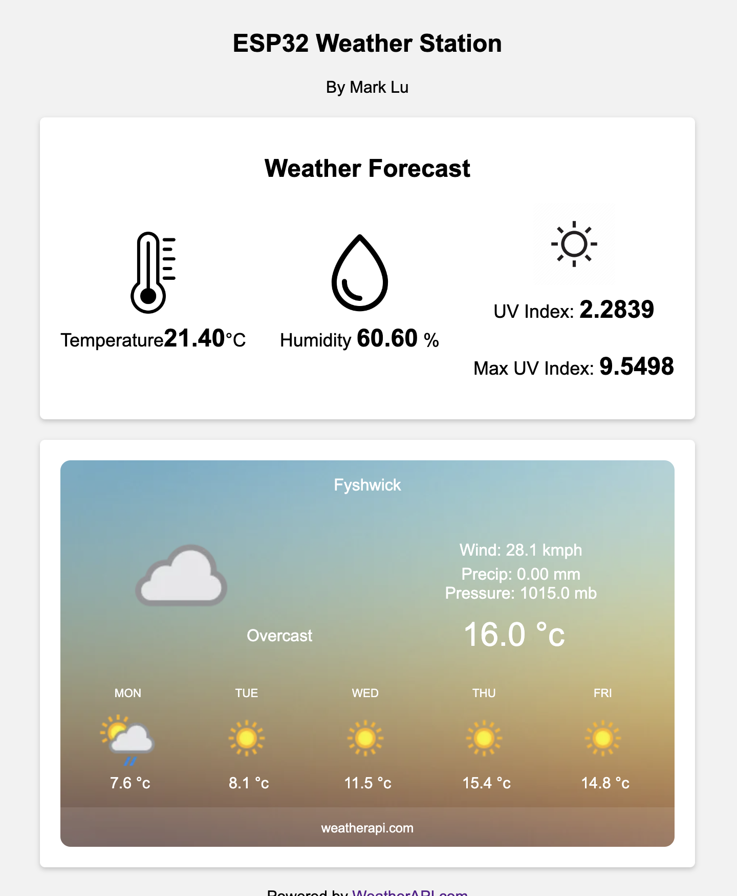
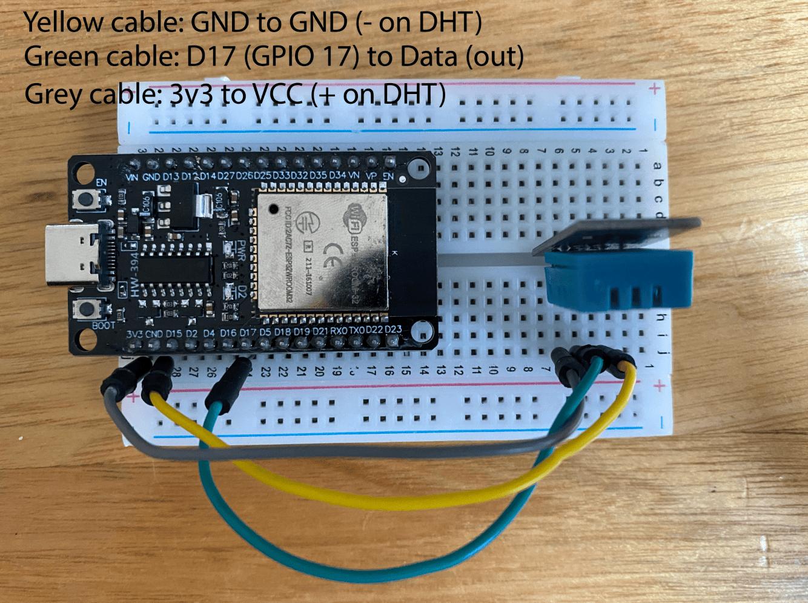

## ESP32 Weather Station README

This repository contains code for an ESP32 Weather Station
that gathers data from a connected sensor and displays it
on a web interface. The project is built using Node.js,
Socket.io, Express, and the SerialPort library. Below you
will find instructions on setting up and running the weather station.

Additionally, using a free api from [Open UV](https://www.openuv.io/) 
you can display UV data such as the current UV and the max UV for the day.

 


<details>
  <summary style="font-size: x-large">Table of Contents</summary>
  <ol>
    <li ><a href="#how-it-works">How it works</a></li>
    <li><a href="#components">Components</a></li>
    <li><a href="#prerequisites">Prerequisites</a></li>
    <li><a href="#dht22-and-dht22-wiring-guide ">DHT22 and DHT22 Wiring Guide</a></li>
    <li><a href="#installation">Installation</a></li>
    <li><a href="#getting-started">Getting started</a></li>
    <li><a href="#uv-data-optional">UV Data</a></li>
    <li><a href="#usage">Usage</a></li>
    <li><a href="#author">Author</a></li>
    <li><a href="#dependencies">Dependencies</a></li>
    <li><a href="#acknowledgments">Acknowledgments</a></li>

  </ol>
</details>


# How It Works

## Overview

This project utilises an ESP32 microcontroller along with a DHT22 sensor to read temperature and humidity data. The collected data is then transmitted to a computer via the serial port. Using the Node.js environment, a web server is set up to parse this data and display it on a local website. Additionally, the project integrates with an API to provide a 7-day weather forecast.

## Components

### ESP32 Microcontroller

The ESP32 is the core component of this project. It serves as the hardware platform responsible for reading data from the DHT22 sensor and transmitting it to the computer.

### DHT22 Sensor

The DHT22 sensor is employed to measure temperature and humidity. It provides accurate readings, which are critical for this project's functionality.

### Serial Communication

The ESP32 sends temperature and humidity data over the serial port to the connected computer. The data is transmitted in a structured format, which will be parsed and processed by the Node.js script.

### Node.js and SerialPort Library

Node.js is utilized to create a web server and handle the data received from the serial port. The SerialPort library is employed to establish a connection to the ESP32 and parse the data as it arrives. This data is then made available for display on a local website.

### Local Web Server

The Node.js script starts a local web server, enabling you to access the temperature and humidity data in real-time via a web browser on your computer. This provides a convenient and user-friendly way to monitor the environmental conditions.

### Weather Forecast API

In addition to displaying real-time temperature and humidity data, this project leverages a weather forecast API to fetch a 7-day weather forecast for your location. The forecast is displayed alongside the current conditions on the local website.

## Prerequisites

Before you begin, make sure you have the following software and hardware components ready:

- **ESP32**: The ESP32 microcontroller board with a temperature and humidity sensor connected to it.

- **Temperature and Humidity Sensor**: In my project I am using a DHT22, however you can also use a DHT11 as well. You will just need to change the C++ code to define
 the sensor as a DHT11 instead of a DHT22

- **Node.js**: Ensure that Node.js is installed on your development machine. If not, you can download it from [nodejs.org](https://nodejs.org/).
  
- **Git**: Ensure git is installed in order to clone the repository. If you do not have it downloaded you can download it from [git-scm.com/downloads](https://git-scm.com/downloads).
  
- OpenUV api key (optional), if you want to display the current UV and the maximum UV you can create an account and get a free API from [openuv.io](https://www.openuv.io/).

- At the top of your HTML file you will need to add a CDN for the socketio library

```
<script src='https://cdnjs.cloudflare.com/ajax/libs/socket.io/2.0.4/socket.io.js'></script>
```
  

## DHT22 and DHT22 Wiring Guide 

Connect the VCC to the 3v3
<br>
Connect GND to GND 
<br>
Connect S to GPIO 17 (data)


Wiring guide for the DHT22

DHT11 Wiring Guide
<br>
DHT11 Pinout





<br>

## Installation

Go into your package.json and put these libraries in the dependencies

```
"serialport": "^12.0.0",
"socket.io": "^2.0.4"
```

After putting these libraries into your dependencies, go to the terminal and type:

```
npm install
```

- **Arduino IDE**: You will need the arduino IDE to run the ino file

```
https://www.arduino.cc/en/software
```
- **DHT Library**: In order to use the DHT22 or DHT11 to read temperatures you will need to get the DHT adafruit library

```
https://www.arduino.cc/reference/en/libraries/dht-sensor-library/
```


## Getting Started


1. Use the code from weather_app.ino and upload it to your esp32 in your arduino IDE.
2.  Clone this repository to your local machine:

   ```bash
   git clone https://github.com/Mark7-dev/esp32_weatherstation
   ```

3. Navigate to the project folder:
  ```bash
   cd esp32-weather-station
   ```
3. Connect ESP32 to your computer
   
4. Open the Arduino IDE

5. Upload the code in from the weather_app.ino onto your ESP32 board.
   
6. Close the IDE, to free up the port

7. Modify the "index.html" file if needed. This HTML file is served to clients and displays weather information.

8. Update the "path" property in the Node.js code ("main.js") to match the serial port where your ESP32 is connected:

```javascript
const SERIAL_PORT_PATH = '/dev/cu.usbserial-10';
const BAUD_RATE = 9600;
const DATA_BITS = 8;
const PARITY = 'none';
const STOP_BITS = 1;
```


9. Run the Node.js application:

```bash
node main.js
```

10. Access the weather station web interface by opening a web browser and navigating to `http://localhost:6900`.

## UV data (optional)

1. Get an OpenUV api key from [openuv.io](https://www.openuv.io/).
2. In the script section located in index.html change the variable "apiKey" to your API key, keep the quotation marks
3. Change the variables longitude and latitude to your longitude and latitude.

   ```javascript
       <script>
            var element = document.getElementById("uv-index");
            var number = parseFloat(element.textContent);

            var apiKey = "YOUR_API_KEY";
            var latitude = YOUR_LATITUDE;
            var longitude = YOUR_LONGITUDE;
            
            var myHeaders = new Headers();
            myHeaders.append("x-access-token", apiKey);
            myHeaders.append("Content-Type", "application/json");
            
            var requestOptions = {
              method: 'GET',
              headers: myHeaders,
              redirect: 'follow'
            };
            
            // Fetch UV data from the OpenUV API
            fetch(`https://api.openuv.io/api/v1/uv?lat=${latitude}&lng=${longitude}&alt=100&dt=`, requestOptions)
              .then(response => response.json())
              .then(data => {
                // Update the HTML elements with UV data
                document.getElementById('uv-index').textContent = data.result.uv;
                document.getElementById('max-uv-index').textContent = data.result.uv_max;
                document.getElementById('ozone').textContent = data.result.ozone;
                // Add code to display other relevant data if needed
              })
              .catch(error => console.log('Error:', error));

              
            </script>
            
   ```

## Usage

- The web interface displays temperature and humidity information received from your ESP32 in real-time.

- The temperature and humidity values are updated automatically whenever new data is received from the ESP32.

- You can customise the web interface by modifying the `index.html` file.

## Author

- Mark Lu

## Dependencies

- Socket.io v2.0.4
- SerialPort v12.0.0


## Acknowledgments

- Thanks to the open-source community for providing the necessary libraries and tools to build this weather station.

**Resources used:** 
- [Writing a good README](https://www.freecodecamp.org/news/how-to-write-a-good-readme-file/)
- [DHT11/DHT22 Web Server](https://randomnerdtutorials.com/esp32-dht11-dht22-temperature-humidity-web-server-arduino-ide/)
- [DHT11/DHT22 Arduino Code](https://www.upesy.com/blogs/tutorials/dht11-humidity-temperature-sensor-with-arduino-code-on-esp32-board#)
- [How to make a web socket](https://www.engineersgarage.com/how-to-build-a-node-js-server-to-control-arduino-from-a-webpage/)
- [Open UV](https://www.openuv.io/) 
- [Communicating between the serialport and Node.JS](https://www.youtube.com/watch?v=__FSpGHx9Ow)

**Images used:**
- https://www.flaticon.com/free-icon/thermometer_4158502
- https://www.freepik.com/icon/water-drop_3046562
- https://cdn0.iconfinder.com/data/icons/small-nature/50/3_Sep-11-512.png
